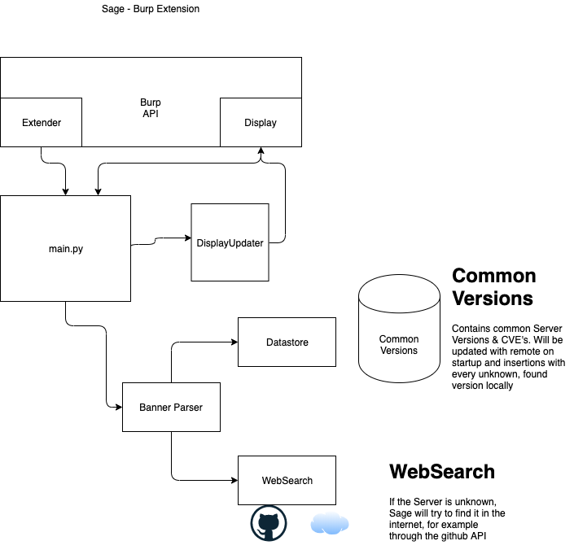

## Sage - Software Age Burp Extension
### Preface
Sage is a work in progress right now. Feel free to follow the project. I am developing on it in my free time, so there are no milestones/deadlines set for now.

### Install
To install python extensions in Burp you will need Jython. Follow the instructions from here (Step Initial Setup): [Burp Python Extension](https://laconicwolf.com/2018/04/13/burp-extension-python-tutorial/)

Right now there are no requirements in the requirements.txt so you can load the botto extension directly.
You will have to load the `main.py` through the Extension option in Burp.

### Usage
Browse on your target scope. Sage will show up on the response tab if a server banner is in the response.

Following information will be shown in the future:
- Server
- Version
- Age
- CVEs

### Architecture

